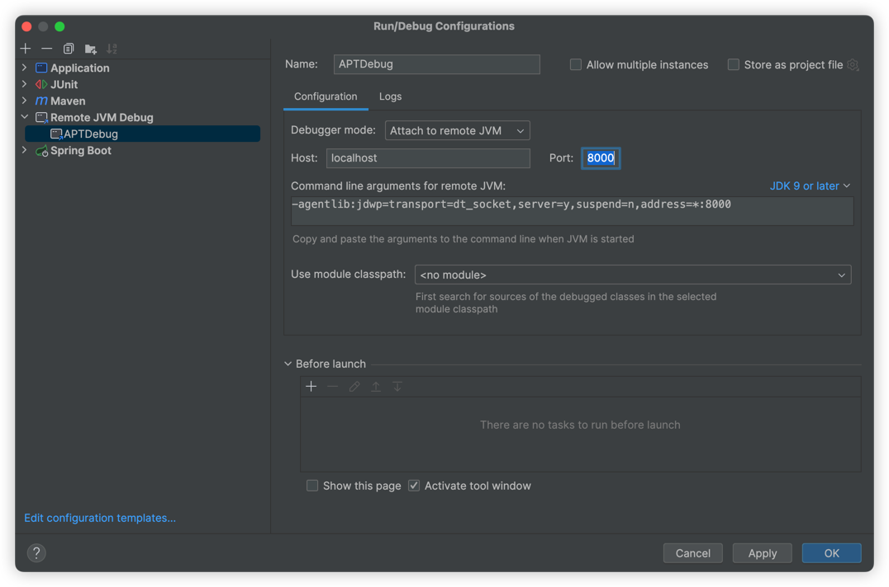

# Lombok Enum Component

> Lombok枚举扩展组件

APT Debug

测试代码步骤：

- test项目代码使用命令启动调试端口：`mvnDebug clean install`
- 该命令将会启动`8000`端口

调试APT代码步骤：

- 进入lombok-enums-component项目
- Edit Configurations...
- 新建一个 Remote JVM Debug
- 
- debug启动

接下来再去test项目中执行相关代码，比如main方法，lombok-enums-component项目中APT相关代码即可进入debug断点！！！

